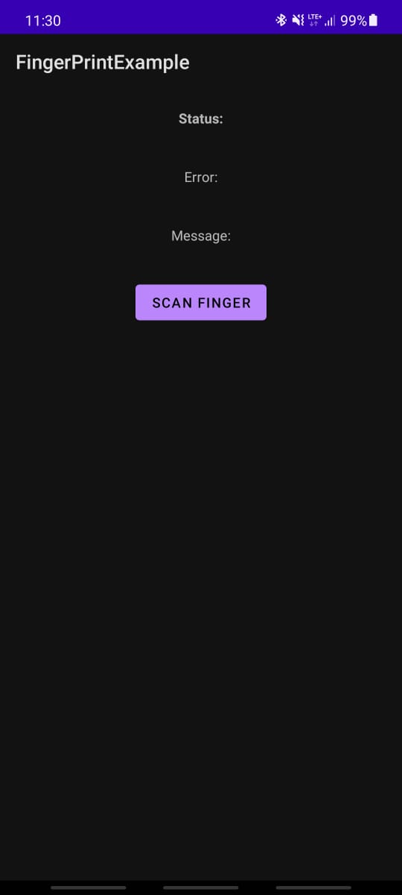
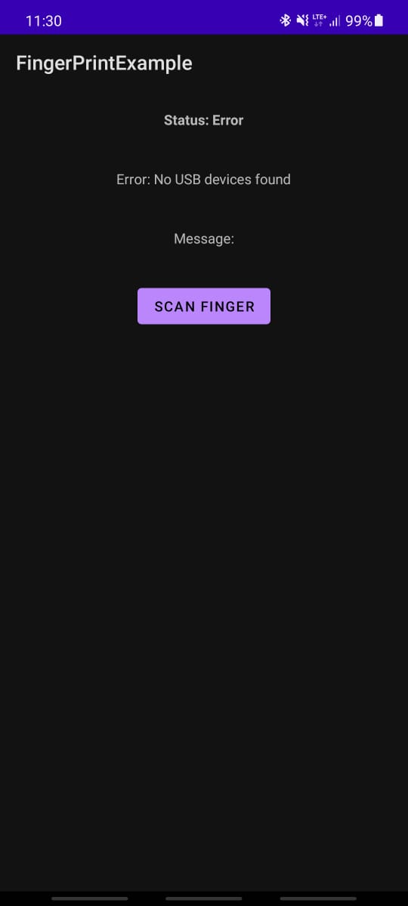
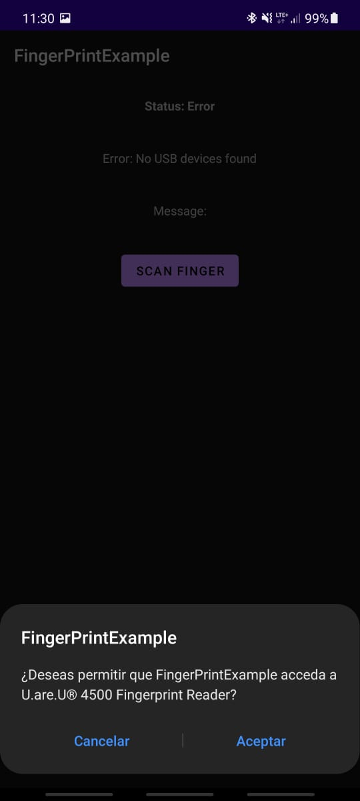
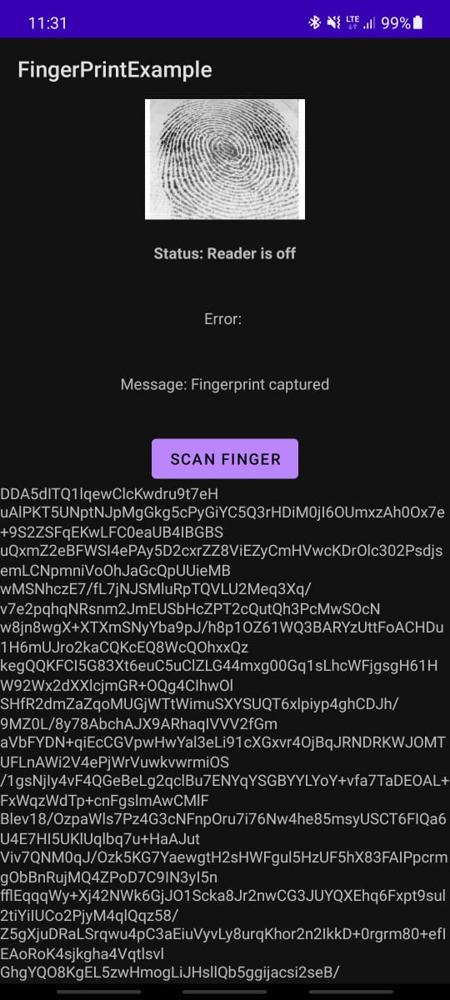

<!-- PROJECT LOGO -->
<br />
<p align="center">
  <a href="https://github.com/alejandrosazo/fingerprint-reader-uareu-android">
    
  </a>

  <h3 align="center">FingerPrint Reader for Android - uareu</h3>

  <p align="center">
    Android application to scan fingerprint with the library U.are.U 4500
  </p>
</p>


<!-- TABLE OF CONTENTS -->
<details open="open">
  <summary>Table of Contents</summary>
  <ol>
    <li>
      <a href="#about-the-project">About The Project</a>
    </li>
    <li>
      <a href="#getting-started">Getting Started</a>
    </li>
    <li><a href="#usage">Usage</a></li>
    <li><a href="#screenshots">ScreenShots</a></li>
    <li><a href="#drawbacks">Drawbacks</a></li>
    <li><a href="#contact">Contact</a></li>
    <li><a href="#acknowledgements">Acknowledgements</a></li>
  </ol>
</details>


<!-- ABOUT THE PROJECT -->
## About The Project

The project is a simple application, created for Android using Java as the language.

Its main functionality is to scan a person's fingerprint through a "digitalPersonal" reader, specifically the U.are.U 4500 model. 


<!-- GETTING STARTED -->
## Getting Started

To use the library in your own project, keep these main lines of code in mind. 


* Enter this maven repository in your project `build.gradle`
  ```Gradle
  // .. rest of your code 
  allprojects {
    // .. rest of your code
    repositories {
      // .. rest of your code
        maven { url 'https://dl.bintray.com/shodgson/uareu4500reader' } //<--- this line is important 
        google()
        jcenter()
    }
  }
  ```

* Enter this code block in your app `build.gradle`
  ```Gradle
  dependencies {
    // ..rest of your dependencies

    implementation fileTree(dir: 'libs', include: ['*.jar'])
    testImplementation 'junit:junit:4.+'
    implementation 'asia.kanopi.tools:fingerscan:0.1'
    implementation 'com.gemalto.wsq:wsq-android:1.2'
  }
  ```
  _Remember the app build.gradle and the project build.gradle are two different files[]()_


<!-- USAGE EXAMPLES -->
## Usage

The application is simple, it only has six components: 
  * `ivFingerDisplay`: Displays the captured fingerprint image.
  * `tvStatus`: Fingerprint reader current status message.
  * `tvError`: Error message in some process.
  * `tvMessage`: Process status message.
  * `buttonScan`: Button to start the scanning process.
  * `base64View`: Displays the base64 of the scanned image.

In the `MainActivity.java` there are 3 methods:
 
 1. <strong>startScan:</strong>
  
    Call the library instance `asia.kanopi.fingerscan.Fingerprint`

 2. <strong>updateHandler:</strong>

    Updates the state of the physical fingerprint reader, the state depends on the actions that the printHandler method will perform.

 3. <strong>printHandler:</strong>

    Gets the scanned fingerprint data and returns a ByteArray which is then decoded. 

<!-- SCREENSHOTS -->
## ScreenShots
<p align="center">





</p>

<!-- DRAWBACKS -->
## Drawbacks

* The application requires the "digitalPersonal" reader to be connected via an OTG cable. Therefore, every time you want to test, you must disconnect the phone and the debugging will stop.

* It is not possible to connect the fingerprint reader to the computer and test it through the Android Studio emulator. If you find any way to do this, leave a suggestion on how to do it. 

<!-- CONTACT -->
## Contact

Alejandro Sazo - ottoalejandrobonilla2014@gmail.com

Project Link: [https://github.com/alejandrosazo/fingerprint-reader-uareu-android](https://github.com/alejandrosazo/fingerprint-reader-uareu-android)


<!-- ACKNOWLEDGEMENTS -->
## Acknowledgements
Special thanks to Steven Hodgson steven@kanopi.asia.

The base code can be found in the following repository:
* [uareu](https://github.com/shodgson/uareu)

[screenshot1]: images/Screenshot1.jpeg
